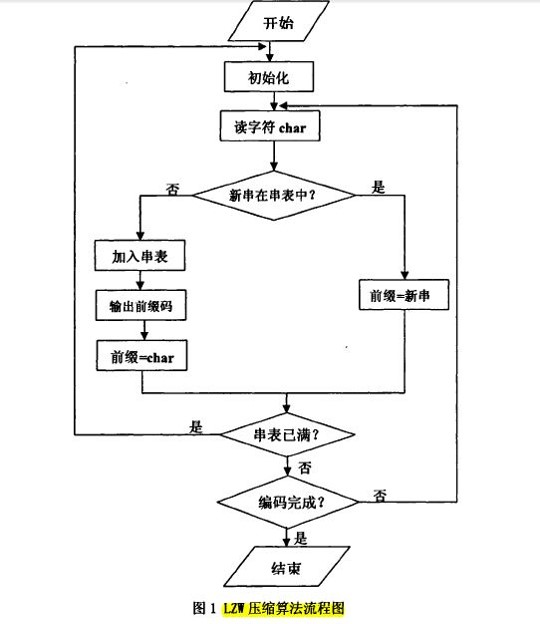
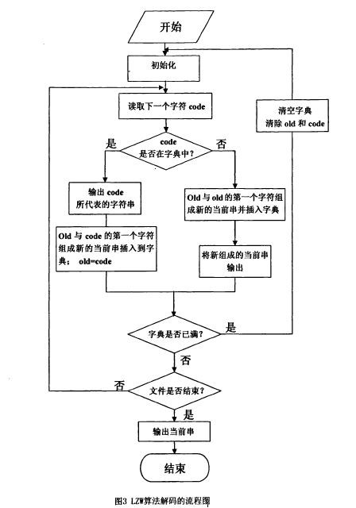
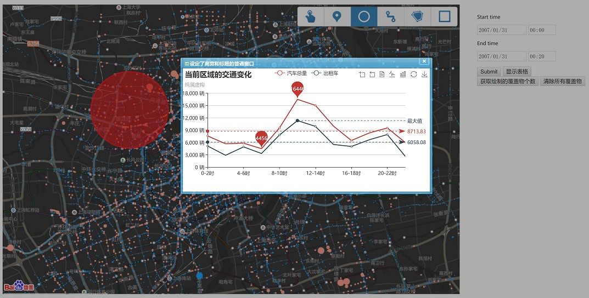

## 欢迎来到我的主页

面试的时候受打击了。不知道说啥项目，显得我很水，好吧我确实有点水，总结总结。  
总结完之后，发现确实比较水，没啥技术含量。  

### 天文数据压缩算法的研究  
这个是在大二的暑假和大三上学期里做的。当时是想用硬件实现，奈何verilog的逻辑始终理解不了。现在看来我当时做的好水呀，尤其是这论文和ppt写的，一点也不规范。    
#### 1. 使用Huffman编码  
算法的关键在于统计出各符号出现的频率，以及正确建立哈夫曼树。算法比较简单。但是需要两次扫描，而且解压缩需要编码表。  
频率在高的字符几乎占到了总字符的50%，这就意味着，剩下的字符出现的频率相差无几，并且由于建立哈夫曼树硬件上实现比较困难，这样建立哈夫曼树的效果就显得没有必要。  
如果将出现频率最高的字符用一个字节代替，而剩余的字节在原基础上扩充一位，这样压缩或每个字符的平均字节数约为1×50%+（8+1）×50%=4.5。压缩比约为4.5⁄8=56.25%。  
#### 2. LZW编码  
LZW是通过建立一个字符串表，用较短的代码来表示较长的字符串来实现压缩。 应该注意到的是，这里的编译表不是事先创建好的，而是根据原始文件数据动态创建的，解码时还要从已编码的数据中还原出原来的编译表。

LZW算法基于字典，压缩有3个重要的对象：数据流(Char Stream)、编码流(Code Stream)和编译表(String Table)。  
LZW的编码词典，用来存放字符串项，每个表项被分配一个代码，转换表实际上是把8位ASCII字符集进行了扩充，增加的符号用来表示在文本中出现的可变长长度ASCII字符串。  
字典压缩算法利用简单代码代替符号串，充分利用了相邻数据的相关性。  
LZW编码只需扫描一次数据，无需有关输入数据统计量的先验信息而运算时间正比于消息的长度。  
其自适应的特点，使得在编码过程中清空字典以及解码过程中不需要压缩过程中建立的字典。  

  
  

相关文件：[结题论文](file/USRP/大学生研究计划结题报告-薛兆江.pdf)  打开好慢呀，直接去github上下载吧。  
  
  

### 纳米低温手术过程实验研究  
这个是本科毕业论文，看起来又是纳米又是低温的，其实核心技术是测温，而且是用很low的热电偶测温。客观来说，没啥技术含量，就是自己做了个探针，堆时间做实验。这篇论文在格式、架构上个人不谦虚地说————堪称完美。文章的组织和解决问题的分析过程，都体现出物理学出身的思路。  
在测量纳米粒子浓度对降温速率影响时，发现实验难点首先在于每次实验冷刀的工作状态不同，这导致即使相同浓度的纳米粒子降温速率也不尽相同；其次测温度用的探针尺寸不能太大，而且探针的位置应尽量保证不变， 这两个原因导致难以对比出不同浓度的纳米粒子对降温速率的影响。为了解决这两个问题，我制作了如下图的装置。  
  
  
  
我一直认为我做的这个实验是十分有问题的。实验数据根本不符合正态分布，由中心极限定理说明数据不同质，也就是不是独立同分布。这一点都做不到，谈什么统计规律。其次实验不可控因素太多，例如降温过程的稳定性、测温位置的精确度、每次实验体膜中的琼脂经过升温降温是否特性一致、体膜中纳米粒子的分布是否均匀，导致实验不可重现，对于实验来说不可重现，几乎相当于造假。    
相关文件：[毕业论文](file/GraduateThesis/薛兆江本科毕业论文.pdf)  [实验记录](file/GraduateThesis/薛兆江本科毕业论文实验记录.pdf)  
  
### Linux内核分析  
跟着课程一共写了8篇博客，详细可见连接[Linux内核分析](https://xuezhaojiang.github.io/LinuxCore/)。主要是函数调用堆栈、中断机制、进程调度。  
ps:深入理解计算机系统这本书刚学的时候感觉好，后来再看是真的好。这本书是真的强，什么都有，值得细细研读。  
  
  

### 算法  
主要实现过链表、红黑树极其可视化输出、图的遍历和Dijkstra最短路径、快速排序。  
[github链接](https://github.com/xuezhaojiang/Algorithm)  
数据结构这本书我居然还有内容没看呢，还得再研究研究。  
  


### Socket编程
#### 1.聊天室功能的实现  
客户端开启两个进程，一个用于接受服务器端发送来的消息，另一个进程用来向服务器端发送消息。  
服务器端创建出一个ServerSocket对象来侦听来自于客户端的连接，新添加一个客户端便新开一个线程，每个线程对应一个与客户端的连接，并且用动态数组管理当前的客户端。服务器端的线程通过循环检查客户端的输入，并且将输入公布给每个客户端。  
TCP是面向连接的，即使是聊天室中那样类似与广播，本质上也是通过一对一发送消息实现的，也就是在应用层模拟的广播。  
UDP可以通过受限广播地址实现运输层意义上的广播。  
#### 2.UDP传输文件  
tcp是在运输层来检查是否有丢失数据，udp并不检查这一点，为了做的不丢包，自能在应用层检查，也就是接收方给予反馈。  
  
  
  
### 轻量级J2EE框架应用  
1. 理解MVC(Model View Controller)架构，http request在Web Container中的处理流程  
servlet编程，需要引用以下两个类和接口：javax.servlet和javax.servlet.http。当Servlet类实例化后，容器加载init，以通知servlet它已进入服务行列。init方法必须被加载，Servelt才能接收和请求。如果要载入数据库驱动程序、初始化一些值等等，程序员可以重写这个方法。在其他情况下，这个方法一般为空。service方法由Servlet容器调用，以允许Servlet响应一个请求。Servlet容器传递javax.servlet.ServletRequest 对象和 javax.servlet.ServletResponse对象。ServletRequest对象包含客户端HTTP请求信息，ServletResponse则封装servlet响应。这两个对象，可以写一些需要servlet怎样服务和客户怎样请求的代码。从service中删除Servlet实例之前，容器调用destroy方法。在servlet容器关闭或servlet容器需要更多的内存时，就调用它。这个方法只有在servlet的service方法内的所有线程都退出的时候，或在超时的时候才会被调用。在servlet容器调用destroy方法之后，它将不再调用servlet的service方法。destroy方法给了servlet机会，来清除所有候住的资源（比如：内存，文件处理和线程），以确保在内存中所有的持续状态和servlet的当前状态是同步的。  
web.xml的加载过程。当我们去启动一个WEB项目时，容器包括（JBoss、Tomcat等）首先会读取项目web.xml配置文件里的配置，当这一步骤没有出错并且完成之后，项目才能正常地被启动起来。
* 启动WEB项目的时候，容器首先会去它的配置文件web.xml读取两个节点:<listener></listener>和<context-param></context-param>。
* 紧接着，容器创建一个ServletContext（application），这个WEB项目所有部分都将共享这个上下文。
* 容器以<context-param></context-param>的name作为键，value作为值，将其转化为键值对，存入ServletContext。
* 容器创建<listener></listener>中的类实例，根据配置的class类路径<listener-class>来创建监听，在监听中会有contextInitialized(ServletContextEvent args)初始化方法，启动Web应用时，系统调用Listener的该方法，在这个方法中获得：ServletContext application =ServletContextEvent.getServletContext();context-param的值= application.getInitParameter("context-param的键");得到这个context-param的值之后，你就可以做一些操作了。举例：你可能想在项目启动之前就打开数据库，那么这里就可以在<context-param>中设置数据库的连接方式（驱动、url、user、password），在监听类中初始化数据库的连接。这个监听是自己写的一个类，除了初始化方法，它还有销毁方法，用于关闭应用前释放资源。比如:说数据库连接的关闭，此时，调用contextDestroyed(ServletContextEvent args)，关闭Web应用时，系统调用Listener的该方法。  
* 接着，容器会读取<filter></filter>，根据指定的类路径来实例化过滤器。  
* 以上都是在WEB项目还没有完全启动起来的时候就已经完成了的工作。如果系统中有Servlet，则Servlet是在第一次发起请求的时候被实例化的，而且一般不会被容器销毁，它可以服务于多个用户的请求。所以，Servlet的初始化都要比上面提到的那几个要迟。  
2. 控制器根据配置文件controller.xml来决定把请求分发给哪个action以及将请求处理结果转到哪个页面。  
3. 配置文件中添加拦截器节点，利用拦截器实现日志记录。  
4. XSL转换机制可以指定将xml文档转化为其他格式的规则。需要提供xslt样式表，它描述xml向某种其他格式转换的规则。xslt处
理器将读入xml文档和这个样式表，并产生相应的输出。本次作业中就是将xml文档转换为html文档，供浏览器显示。  
5. 用访问数据库的方式来获取数据。DAO是data access object数据访问接口，既然是对数据的访问，就是与数据库打交
道。访问数据库过程：加载驱动类；通过url、username、password获取数据库连接；创建一个Statement对象，Statement对象用于将SQL语句发送到数据库中；执行sql；解析查询结果、关闭数据库连接。  
Hibernate核心接口：  
* Configuration接口，Configuration负责管理Hibernate的配置信息。  
* SessionFactory接口。SessionFactory负责创建Session实例，可以通过Configuration实例构建SessionFactory。SessionFactory保存了对应当前数据库配置的所有映射关系，采用了线程安全的设计，可由多个线程并发调用。  
* Session接口。Session是Hibernate持久化操作的基础，提供了众多持久化方法，如save、update、delete等。通过这些方法，透明地完成对象的增删改查等操作。同时，值得注意的是，Hibernate Session的设计是非线程安全的，即一个Session实例同时只可由一个线程使用。  
* Transaction接口。Transaction是Hibernate中进行事务操作的接口，Transaction 接口是对实际事务实现的一个抽象，这些实现包括JDBC的事务、JTA 中的UserTransaction，甚至可以是CORBA事务。  
* Query接口。Query接口，用于执行HQL语句。Query和HQL是分不开的。HQL是Hibernate Query Language的缩写。SQL的操作对象是数据表和列表等对象，而HQL操作对象是类、实例和属性等。  
6. 通过配置文件中获得数据库连接信息和Bean和数据表的对应信息。还有实现延迟加载。  
7. 在配置文件中写各个bean的依赖关系，和依赖注入。  
  
  
  
### 基于云平台的大数据路网流量管控  
这个是软件工程实践项目，和何金龙、付何山、郭焯荣同学一起做的。  
* 采用python＋hadoop搭建数据处理后台；
* 使用mysql作为数据存储数据库； 
* 采用J2EE设计网站实现前后台的数据交互；
* 使用百度api显示gps数据分布；
* 更改数据请求访问方案；
* 使用百度echart前端控件，异步加载数据。
  
  
数据处理后台给的数据格式是jsonObject：  
```
{
	坐标点序号:[纬度,经度,经过的车辆数目,[车辆经过的时间JSONArray数组]],...
}
```
我做的是前端发送一个时间段，java web后台根据这个时间段从车辆经过的时间JSONArray数组中筛选符合这个时间段的时间，更新经过的车辆数目，将数据返回给前端。  
发送给前端的LinkedList数据的结点格式：  
```
[纬度，经度，经过的车辆数目，[车辆经过的时间JSONArray数组]
```
前端根据车辆数目对数据分类，在对应坐标点上加载不同的颜色。  
  
  
  
### 软件设计模式  
这个是和刘艳、王剑同学一起做到课程作业，我是组长。  
1. 用例分析与用例建模。根据需求文档识别抽象用例、绘制抽象用例图、高级用例分析、扩展用例表。  
2. 领域建模。采集领域信息、领域知识分类、绘制领域类图模型。  
3. 对象交互建模。对扩展用例中的Nontrivial Step进行情景建模，绘制时序图。  
4. 设计类图。根据开放闭合原则、单一职责原则、合成复用原则、Liskov替换原则、依赖倒置原则、接口隔离原则、最少知识原则。  
5. 使用GRASP和GoF设计模式。要求给出设计类图和核心代码。代理模式实现图片延迟，仲裁者模式实现多对象交互的解耦、迭代器模式。  
  
  
  
  
### 联系我  
  
[github](https://github.com/xuezhaojiang/)用户名:xuezhaojiang  [zhihu](https://www.zhihu.com/people/xuezhaojaing/activities)用户名:个性耀世界  [Email](602431866@qq.com)602431866@qq.com  
  

### 最后以几句名言结尾，用以自勉。  
皇叔刘备劝勉刘禅时说的话  
> 勿以恶小而为之，勿以善小而不为。  

颜回回答孔子的话  
> 孔子曰：“回，诗云‘匪兕匪虎，率彼旷野’。吾道非邪？吾何为于此？”颜回曰：“夫子之道至大，故天下莫能容。虽然，夫子推而行之，不容何病，不容然后见君子！夫道之不修也，是吾丑也。夫道既已大修而不用，是有国者之丑也。不容何病，不容然后见君子！”  
